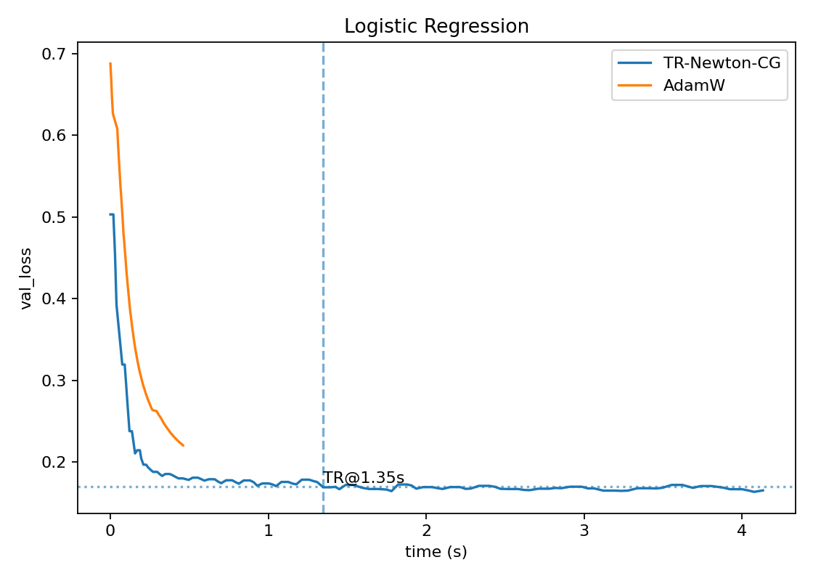

# Trust-Region Newton–CG (PyTorch)
Custom trust-region Newton–CG optimizer (mini-batch HVPs, diagonal preconditioning, adaptive radius, safe fallback) + reproducible benchmarks.

## Results (Logistic Regression)
- Reached **val-loss ≈ 0.17 in ~1.35s** with **~0.75 step-accept rate** and **~1.8 CG iters/step**.
- Under the same 120-step run, **AdamW plateaued ≈ 0.22**.



## Install
```bash
python3 -m venv .venv && source .venv/bin/activate
pip install -U pip
pip install -r requirements.txt
